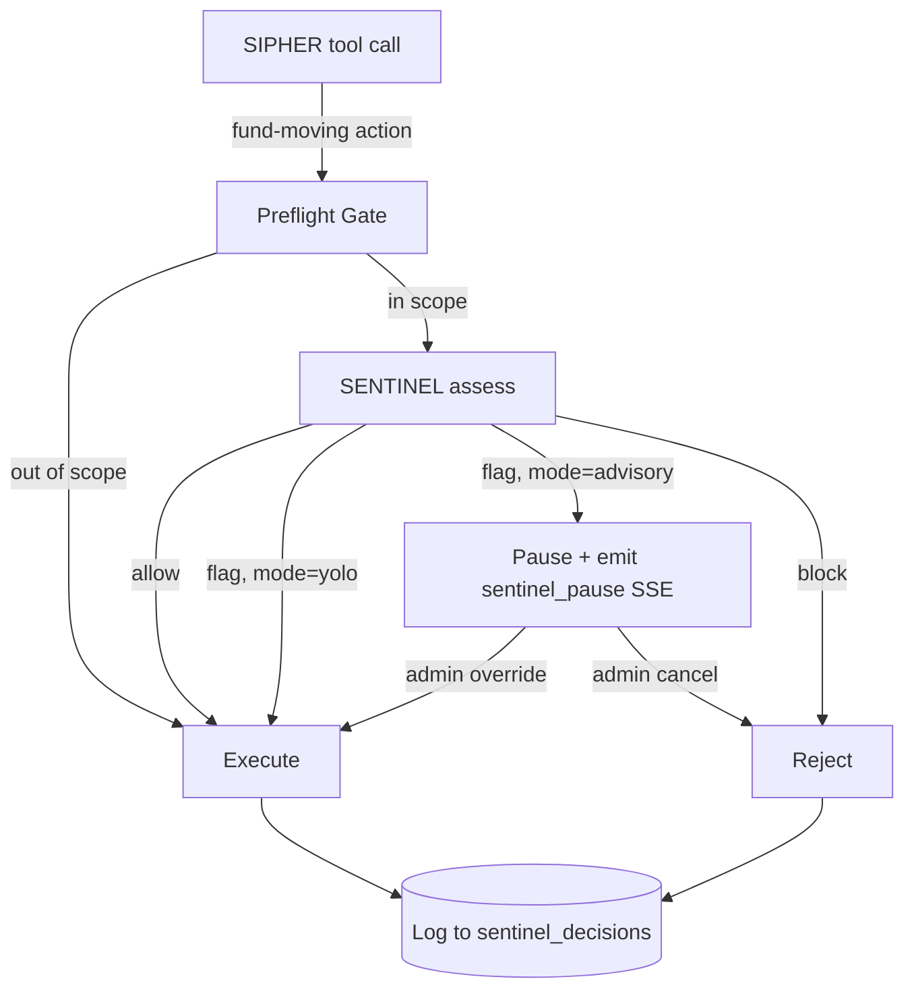

# SENTINEL Surface Docs Implementation Plan

> **For agentic workers:** REQUIRED SUB-SKILL: Use superpowers:subagent-driven-development (recommended) or superpowers:executing-plans to implement this plan task-by-task. Steps use checkbox (`- [ ]`) syntax for tracking.

**Goal:** Ship `docs/sentinel/{README,rest-api,tools,config,audit-log}.md` and JSDoc on public SENTINEL surfaces, with zero behavior changes, in a single PR against main.

**Architecture:** Five Markdown files under `docs/sentinel/` covering REST API, agent tools, config env vars, and audit log schema. Inline JSDoc added to 10 route handlers, 14 tool exports, the `SentinelConfig` interface, `getSentinelConfig`, and `pending.ts` exports — each JSDoc cross-referencing the corresponding MD anchor. All examples use source-verified data captured from a one-shot local agent boot.

**Tech Stack:** Markdown (with GitHub-rendered Mermaid diagrams + admonition callouts), TypeScript JSDoc syntax, no new dependencies. Verification via `pnpm typecheck`, `pnpm test -- --run`, and live curl against `localhost:3000`.

**Spec:** `docs/superpowers/specs/2026-04-27-sentinel-surface-docs-design.md`

---

## Files To Be Created or Modified

### New files
- `docs/sentinel/README.md`
- `docs/sentinel/rest-api.md`
- `docs/sentinel/tools.md`
- `docs/sentinel/config.md`
- `docs/sentinel/audit-log.md`

### Modified (JSDoc + file-header pointer only — zero behavior change)
- `packages/agent/src/routes/sentinel-api.ts` — 10 route handlers
- `packages/agent/src/sentinel/config.ts` — `SentinelConfig` interface (15 properties) + `getSentinelConfig`
- `packages/agent/src/sentinel/pending.ts` — `createPending`, `resolvePending`, `rejectPending`
- `packages/agent/src/sentinel/tools/*.ts` — 14 tool exports

### Modified (gitignore only)
- `.gitignore` — add `/tmp/sentinel-capture` is `/tmp` so already untracked; if local capture dir is created in repo, add `e2e/sentinel-capture/`

---

## Naming Conventions (apply throughout)

| Surface | Convention in docs | Example |
|---|---|---|
| Tool name | camelCase (matches LLM tool `name` property) | `getVaultBalance` |
| Tool file path | kebab-case (filesystem) | `packages/agent/src/sentinel/tools/get-vault-balance.ts` |
| MD anchor | lowercase, hyphenated (GitHub auto-slug) | `#getvaultbalance` |
| REST route | as-defined | `POST /api/sentinel/assess` |
| REST anchor | lowercase, hyphenated | `#post-apisentinelassess` |
| Env var | UPPER_SNAKE_CASE | `SENTINEL_MODE` |
| SQLite table | `sentinel_*` prefix | `sentinel_decisions` |

---

### Task 1: Branch setup

**Files:** none (git ops)

- [ ] **Step 1: Confirm spec branch state**

Run: `cd ~/local-dev/sipher && git status && git branch --show-current`

Expected: clean working tree on `docs/sentinel-surface-docs-spec` with at least 2 commits ahead of main (spec + spec amendment).

- [ ] **Step 2: Branch off spec branch for implementation**

Run: `cd ~/local-dev/sipher && git checkout -b feat/sentinel-surface-docs`

Expected: switched to new branch; spec + plan files visible at `docs/superpowers/specs/2026-04-27-sentinel-surface-docs-design.md` + `docs/superpowers/plans/2026-04-27-sentinel-surface-docs.md`.

- [ ] **Step 3: Verify baseline tests pass on this branch**

Run:
```bash
pnpm --filter @sipher/agent test -- --run 2>&1 | tail -3
pnpm --filter @sipher/app test -- --run 2>&1 | tail -3
```

Expected: agent suite reports 938+ passed; app suite reports 45+ passed. Save the exact numbers — they are the post-implementation baseline.

---

### Task 2: Capture sample data from a local agent boot

**Files:**
- Read: `e2e/fixtures/auth.ts` (existing `mintAdminJwt` helper)
- Read: `~/Documents/secret/cipher-admin.json` (admin keypair, gitignored)
- Read: `packages/agent/src/db.ts:159-228` (SENTINEL CREATE TABLE statements)
- Create: `e2e/sentinel-capture/` (gitignored — used by subsequent tasks)
- Modify: `.gitignore`

**Reason:** Subsequent doc-writing tasks need real curl responses + sample SQLite rows. Capture them once into `/tmp/sentinel-capture/` (so subagents in subsequent tasks can read), then kill the agent. The `Last verified` footer in each MD file will all use today's date.

- [ ] **Step 1: Add capture path to gitignore**

Modify `.gitignore` — append at the end:
```
# SENTINEL spec-capture artifacts (transient)
e2e/sentinel-capture/
.env.spec
```

- [ ] **Step 2: Boot the agent in the background**

Run:
```bash
cd ~/local-dev/sipher
mkdir -p e2e/sentinel-capture

# Generate a fresh JWT secret for the capture session
JWT_SECRET=$(openssl rand -hex 32)
echo "JWT_SECRET=$JWT_SECRET" > .env.spec

# Boot the agent
JWT_SECRET=$JWT_SECRET \
  AUTHORIZED_WALLETS=C1phrE76Wrkmt1GP6Aa9RjCeLDKHZ7p4MPVRuPa8x85N \
  SENTINEL_MODE=advisory \
  SIPHER_DB_PATH=./e2e/sentinel-capture/db.sqlite \
  HERALD_ENABLED=false \
  pnpm --filter @sipher/agent dev > /tmp/sipher-spec-boot.log 2>&1 &
AGENT_PID=$!
echo "AGENT_PID=$AGENT_PID" > .env.spec.pid

# Wait for /health
for i in $(seq 1 30); do
  if curl -sf http://localhost:3000/health >/dev/null; then echo "agent ready"; break; fi
  sleep 1
done
```

Expected: `agent ready` printed within 30 seconds. If not, inspect `/tmp/sipher-spec-boot.log` for boot errors before continuing.

- [ ] **Step 3: Mint admin JWT via existing helper**

Create a tiny one-shot script `e2e/sentinel-capture/mint.mjs`:
```js
import { mintAdminJwt } from '../fixtures/auth.js'

const { token, wallet, isAdmin } = await mintAdminJwt(
  process.env.HOME + '/Documents/secret/cipher-admin.json',
  'http://localhost:3000',
)
console.log(JSON.stringify({ token, wallet, isAdmin }))
```

Run:
```bash
node --experimental-vm-modules e2e/sentinel-capture/mint.mjs > e2e/sentinel-capture/jwt.json
cat e2e/sentinel-capture/jwt.json | jq '.isAdmin'
```

Expected: prints `true`. If `false`, the keypair isn't in `AUTHORIZED_WALLETS` — re-boot with the right env.

- [ ] **Step 4: Capture all GET endpoints**

Run:
```bash
JWT=$(jq -r .token e2e/sentinel-capture/jwt.json)

for endpoint in status blacklist pending decisions; do
  curl -s -H "Authorization: Bearer $JWT" \
    "http://localhost:3000/api/sentinel/$endpoint" \
    | jq . > "e2e/sentinel-capture/get-$endpoint.json"
  echo "captured: get-$endpoint.json"
done
```

Expected: 4 JSON files. Inspect each — they should show real data (status with config, blacklist with at least the empty `entries: []`, etc.).

- [ ] **Step 5: Capture POST /assess**

Run:
```bash
JWT=$(jq -r .token e2e/sentinel-capture/jwt.json)
curl -s -X POST -H "Authorization: Bearer $JWT" -H "Content-Type: application/json" \
  -d '{"action":"vault_refund","wallet":"C1phrE76Wrkmt1GP6Aa9RjCeLDKHZ7p4MPVRuPa8x85N","amount":1.5}' \
  http://localhost:3000/api/sentinel/assess \
  | jq . > e2e/sentinel-capture/post-assess.json

cat e2e/sentinel-capture/post-assess.json | jq '.decision'
```

Expected: a JSON `RiskReport` shape with at least `decision`, `score`, `reasoning`, `flags`. Decision is one of `allow`/`flag`/`block` (verify in `risk-report.ts`).

- [ ] **Step 6: Insert one blacklist entry to capture admin POST + DELETE shape**

Run:
```bash
JWT=$(jq -r .token e2e/sentinel-capture/jwt.json)

# POST /blacklist
INSERT_RES=$(curl -s -X POST -H "Authorization: Bearer $JWT" -H "Content-Type: application/json" \
  -d '{"address":"BAD11111111111111111111111111111111111111","reason":"spec capture sample","severity":"low"}' \
  http://localhost:3000/api/sentinel/blacklist)
echo "$INSERT_RES" | jq . > e2e/sentinel-capture/post-blacklist.json
ENTRY_ID=$(echo "$INSERT_RES" | jq -r .entryId)

# DELETE /blacklist/:id
curl -s -X DELETE -H "Authorization: Bearer $JWT" -H "Content-Type: application/json" \
  -d '{"reason":"spec capture cleanup"}' \
  "http://localhost:3000/api/sentinel/blacklist/$ENTRY_ID" \
  | jq . > e2e/sentinel-capture/delete-blacklist.json
```

Expected: `post-blacklist.json` contains `{ success: true, entryId: "..." }`; `delete-blacklist.json` contains `{ success: true }`.

- [ ] **Step 7: Capture pending/cancel + override/cancel route shapes**

Both promise-gate routes (`/override/:flagId` + `/cancel/:flagId`) require an *actively-pending* flag. The simpler capture: hit them with a fake ID and document the 404 envelope, since the happy path requires an in-flight assess flow that's hard to stage outside an integration test.

Run:
```bash
JWT=$(jq -r .token e2e/sentinel-capture/jwt.json)

curl -s -X POST -H "Authorization: Bearer $JWT" \
  http://localhost:3000/api/sentinel/override/missing-flag-id \
  -w "\n%{http_code}\n" > e2e/sentinel-capture/post-override-404.txt

curl -s -X POST -H "Authorization: Bearer $JWT" \
  http://localhost:3000/api/sentinel/cancel/missing-flag-id \
  -w "\n%{http_code}\n" > e2e/sentinel-capture/post-cancel-404.txt

# Circuit-breaker cancel (a different surface — also expect 404 or success on a fake id)
curl -s -X POST -H "Authorization: Bearer $JWT" -H "Content-Type: application/json" \
  -d '{"reason":"spec capture test"}' \
  http://localhost:3000/api/sentinel/pending/missing-id/cancel \
  -w "\n%{http_code}\n" > e2e/sentinel-capture/post-pending-cancel-404.txt
```

Expected: 404 with `{"error":{"code":"NOT_FOUND","message":"flag not found or expired"}}` for promise-gate routes; pending-cancel returns `{success: false}` (verify in source — see `routes/sentinel-api.ts:84-92`).

- [ ] **Step 8: Capture audit-log schemas + sample rows**

Run:
```bash
sqlite3 e2e/sentinel-capture/db.sqlite ".schema sentinel_blacklist" \
  > e2e/sentinel-capture/schema-sentinel_blacklist.sql
sqlite3 e2e/sentinel-capture/db.sqlite ".schema sentinel_risk_history" \
  > e2e/sentinel-capture/schema-sentinel_risk_history.sql
sqlite3 e2e/sentinel-capture/db.sqlite ".schema sentinel_pending_actions" \
  > e2e/sentinel-capture/schema-sentinel_pending_actions.sql
sqlite3 e2e/sentinel-capture/db.sqlite ".schema sentinel_decisions" \
  > e2e/sentinel-capture/schema-sentinel_decisions.sql

# Sample rows (post-assess populated sentinel_decisions; insert+delete populated sentinel_blacklist soft-removed entry)
sqlite3 -json e2e/sentinel-capture/db.sqlite "SELECT * FROM sentinel_decisions LIMIT 1" \
  > e2e/sentinel-capture/sample-sentinel_decisions.json
sqlite3 -json e2e/sentinel-capture/db.sqlite "SELECT * FROM sentinel_blacklist LIMIT 1" \
  > e2e/sentinel-capture/sample-sentinel_blacklist.json
sqlite3 -json e2e/sentinel-capture/db.sqlite "SELECT * FROM sentinel_risk_history LIMIT 1" \
  > e2e/sentinel-capture/sample-sentinel_risk_history.json
sqlite3 -json e2e/sentinel-capture/db.sqlite "SELECT * FROM sentinel_pending_actions LIMIT 1" \
  > e2e/sentinel-capture/sample-sentinel_pending_actions.json
```

Expected: 4 schema files containing `CREATE TABLE` statements verbatim from `db.ts`. At least `sample-sentinel_decisions.json` and `sample-sentinel_blacklist.json` should contain a row (others may be empty `[]`, which is fine — note in audit-log.md that those tables are populated by other code paths).

- [ ] **Step 9: Stop the agent and confirm captures**

Run:
```bash
AGENT_PID=$(grep AGENT_PID .env.spec.pid | cut -d= -f2)
kill $AGENT_PID 2>/dev/null || true
rm -f .env.spec .env.spec.pid

ls -la e2e/sentinel-capture/
```

Expected: 14+ files in `e2e/sentinel-capture/` (4 GETs, 1 assess, 1 post-blacklist, 1 delete-blacklist, 3 404s, 4 schemas, 4+ samples, 1 jwt.json, 1 mint.mjs).

- [ ] **Step 10: Commit gitignore additions only — capture files stay out of git**

Run:
```bash
git status  # confirm e2e/sentinel-capture/ does NOT appear in tracked changes
git add .gitignore
git commit -m "chore(gitignore): ignore SENTINEL spec-capture artifacts"
```

Expected: a single-file commit; `git status` clean afterward except untracked `e2e/sentinel-capture/`.

---

### Task 3: Write `docs/sentinel/README.md`

**Files:**
- Create: `docs/sentinel/README.md`
- Read: `e2e/sentinel-capture/get-status.json` (for modes default)
- Read: `e2e/sentinel-capture/post-assess.json` (for quickstart curl response)
- Read: `packages/agent/src/sentinel/config.ts:30-38` (for `parseMode` defaults)

- [ ] **Step 1: Write the README**

Create `docs/sentinel/README.md` with this structure:

```markdown
# SENTINEL — External Surface Reference

SENTINEL is Sipher's LLM-backed security analyst. Think of it as the security department of an office building: it watches every fund-moving action, flags suspicious wallets, can pause execution for human review, and logs every decision for audit. This folder is the integrator-facing reference for SENTINEL's external surface.

## Sub-references

- [REST API](./rest-api.md) — 10 endpoints under `/api/sentinel`
- [Agent Tools](./tools.md) — 14 LLM tools + `assessRisk`
- [Configuration](./config.md) — 15 environment variables
- [Audit Log Schema](./audit-log.md) — SQLite tables + decision record format

## Operating Modes

SENTINEL has three modes selected via `SENTINEL_MODE`:

| Mode | Behavior on flagged action | Use when |
|---|---|---|
| `yolo` | Allow the action; log the decision | Default; trusted operator + own wallet |
| `advisory` | Pause execution; require explicit human override | Production VPS; admin-supervised flows |
| `off` | Skip preflight entirely; log nothing | Local dev; tests that bypass risk checks |

**Default:** `yolo` (parsed in `packages/agent/src/sentinel/config.ts:30-33`).

## Decision Flow



## Quickstart

Authenticate and run a one-shot risk assessment:

\`\`\`bash
# Get a JWT (see /api/auth/nonce + /api/auth/verify for the full ed25519 flow)
JWT="<your-token>"

curl -X POST http://localhost:3000/api/sentinel/assess \
  -H "Authorization: Bearer $JWT" \
  -H "Content-Type: application/json" \
  -d '{
    "action": "vault_refund",
    "wallet": "C1phrE76Wrkmt1GP6Aa9RjCeLDKHZ7p4MPVRuPa8x85N",
    "amount": 1.5
  }'
\`\`\`

The response is a `RiskReport` (shape defined in `packages/agent/src/sentinel/risk-report.ts`):

\`\`\`json
[paste content of e2e/sentinel-capture/post-assess.json here, formatted]
\`\`\`

## Cross-references

- Internal design: [`docs/superpowers/specs/2026-04-15-sentinel-formalization-design.md`](../superpowers/specs/2026-04-15-sentinel-formalization-design.md)
- Surface docs design: [`docs/superpowers/specs/2026-04-27-sentinel-surface-docs-design.md`](../superpowers/specs/2026-04-27-sentinel-surface-docs-design.md)

---

*Last verified: 2026-04-27*
```

When pasting `post-assess.json`, run `cat e2e/sentinel-capture/post-assess.json` and embed the actual content (NOT a placeholder).

- [ ] **Step 2: Verify Mermaid renders + all internal links resolve**

Run:
```bash
# Markdown lint via the existing toolchain (if available)
which markdownlint 2>/dev/null && markdownlint docs/sentinel/README.md || echo "no markdownlint, skipping"

# Verify cross-links exist
grep -E '\]\(\.\./|\]\(\./|\]\(\.\.' docs/sentinel/README.md | while read -r line; do
  TARGET=$(echo "$line" | sed -E 's/.*\]\(([^)]+)\).*/\1/')
  TARGET_PATH=$(realpath -m "docs/sentinel/$TARGET" 2>/dev/null || echo "MISSING: $TARGET")
  echo "$TARGET → $TARGET_PATH"
done
```

Expected: every link resolves to either a file that exists today or one that will be created in subsequent tasks (rest-api.md, tools.md, etc.).

- [ ] **Step 3: Commit**

Run:
```bash
git add docs/sentinel/README.md
git commit -m "docs(sentinel): add README overview, modes, decision flow, quickstart"
```

---

### Task 4: Write `docs/sentinel/rest-api.md`

**Files:**
- Create: `docs/sentinel/rest-api.md`
- Read: `packages/agent/src/routes/sentinel-api.ts` (full file — ground truth for routes)
- Read: `e2e/sentinel-capture/*.json` (all captured responses)

- [ ] **Step 1: Verify route count matches plan**

Run:
```bash
grep -E "Router\.(get|post|delete|put|patch)\(" packages/agent/src/routes/sentinel-api.ts | wc -l
```

Expected: 10. If different, update this plan and the spec; do not paper over the discrepancy.

- [ ] **Step 2: Write the file**

Create `docs/sentinel/rest-api.md` following this structure (all 10 routes documented; abbreviated below — engineer fills out **every** route using the captured data):

```markdown
# SENTINEL REST API

All endpoints live under `/api/sentinel`. JWT-based auth via `Authorization: Bearer <token>`.

- **Public** routes require `verifyJwt` only.
- **Admin** routes require `verifyJwt + requireOwner` — wallet must appear in `AUTHORIZED_WALLETS` env var.

> [!WARNING]
> Two distinct cancel routes exist on the admin router and read identically:
> - `POST /api/sentinel/pending/:id/cancel` — cancels a circuit-breaker pending action (SQLite-backed)
> - `POST /api/sentinel/cancel/:flagId` — rejects an in-memory promise-gate flag
>
> They operate on different state stores. See [follow-up issue for rename plan](https://github.com/sip-protocol/sipher/issues/SET-DURING-PR-OPEN).

## Public Endpoints

### POST /api/sentinel/assess

**Auth:** `verifyJwt`
**Description:** Run a one-shot risk assessment for a proposed action. Used by external integrators or internal callers that want a verdict without committing to execution.

**Request body:**
\`\`\`json
{
  "action": "string (required)",
  "wallet": "string (required)",
  "recipient": "string (optional)",
  "amount": "number (optional)",
  "token": "string (optional)",
  "metadata": "object (optional)"
}
\`\`\`

**Response 200:** `RiskReport` — shape in `packages/agent/src/sentinel/risk-report.ts`

\`\`\`json
[paste content of e2e/sentinel-capture/post-assess.json verbatim, formatted]
\`\`\`

**Response 400:** `{"error": "action and wallet are required strings"}` — when the request body is missing required fields.

**Response 503:** `{"error": "SENTINEL assessor not configured"}` — when no LLM provider is wired up (`SENTINEL_MODEL` unset / `OPENROUTER_API_KEY` missing).

**Example:**

\`\`\`bash
curl -X POST http://localhost:3000/api/sentinel/assess \
  -H "Authorization: Bearer $JWT" \
  -H "Content-Type: application/json" \
  -d '{
    "action": "vault_refund",
    "wallet": "C1phrE76Wrkmt1GP6Aa9RjCeLDKHZ7p4MPVRuPa8x85N",
    "amount": 1.5
  }'
\`\`\`

---

### GET /api/sentinel/blacklist

[same template — auth, description, query params, response 200 shape pasted from get-blacklist.json, example curl]

---

### GET /api/sentinel/pending

[same template]

---

### GET /api/sentinel/status

[same template — config snapshot]

---

## Admin Endpoints

Admin routes require both `verifyJwt` AND `requireOwner` middleware. Wallet must appear in `AUTHORIZED_WALLETS`.

### POST /api/sentinel/blacklist

[same template — body shape, response from post-blacklist.json]

---

### DELETE /api/sentinel/blacklist/:id

[same template — soft-remove; response from delete-blacklist.json]

---

### POST /api/sentinel/pending/:id/cancel

[same template; cite that this is the **circuit-breaker** cancel; SQLite-backed; cancels a `sentinel_pending_actions` row via `cancelCircuitBreakerAction`. See `routes/sentinel-api.ts:84-92`. Response from post-pending-cancel-404.txt for the not-found case.]

---

### GET /api/sentinel/decisions

[same template]

---

### POST /api/sentinel/override/:flagId

[same template; cite that this is the **promise-gate** route; in-memory; resolves a pending sentinel pause via `resolvePending`. See `routes/sentinel-api.ts:104-112`. Response 204 on success, 404 with `{"error":{"code":"NOT_FOUND","message":"flag not found or expired"}}` from post-override-404.txt.]

---

### POST /api/sentinel/cancel/:flagId

[same template; cite that this is the **promise-gate** route; in-memory; rejects a pending sentinel pause via `rejectPending(flagId, 'cancelled_by_user')`. See `routes/sentinel-api.ts:114-122`. Response 204 on success, 404 from post-cancel-404.txt.]

---

*Last verified: 2026-04-27*
```

For each route, paste the captured response shape from `e2e/sentinel-capture/` verbatim (after `jq .` formatting). Do not paraphrase.

- [ ] **Step 3: Verify each route in source has a section in the doc**

Run:
```bash
grep -E "Router\.(get|post|delete|put|patch)\(" packages/agent/src/routes/sentinel-api.ts \
  | sed -E "s/.*\.(get|post|delete|put|patch)\(['\"]([^'\"]+)['\"].*/\1 \2/" \
  | sort > /tmp/routes-from-source.txt

grep -E "^### (GET|POST|DELETE|PUT|PATCH) " docs/sentinel/rest-api.md \
  | sed -E "s/^### (GET|POST|DELETE|PUT|PATCH) \/api\/sentinel(.+)$/\1 \2/" \
  | tr 'A-Z' 'a-z' \
  | sort > /tmp/routes-from-doc.txt

diff /tmp/routes-from-source.txt /tmp/routes-from-doc.txt && echo "MATCH" || echo "MISMATCH"
```

Expected: `MATCH`. If `MISMATCH`, fix the doc to cover the missing route(s) before committing.

- [ ] **Step 4: Commit**

Run:
```bash
git add docs/sentinel/rest-api.md
git commit -m "docs(sentinel): add REST API reference (10 endpoints)"
```

---

### Task 5: Write `docs/sentinel/tools.md`

**Files:**
- Create: `docs/sentinel/tools.md`
- Read: `packages/agent/src/sentinel/tools/*.ts` (all 14 files)
- Read: `packages/agent/src/sentinel/tools/index.ts` (verify export list)
- Read: `packages/agent/src/tools/assessRisk.ts` (or wherever `assessRisk` lives — find it first)

- [ ] **Step 1: Find `assessRisk` location**

Run: `grep -rn "name: 'assessRisk'\|name: \"assessRisk\"" packages/agent/src/tools/ packages/agent/src/sentinel/ 2>/dev/null`

Expected: one file. Note its path; it'll be referenced in tools.md.

- [ ] **Step 2: List all 14 SENTINEL tools by their LLM-facing `name` property**

Run:
```bash
for f in packages/agent/src/sentinel/tools/*.ts; do
  [ "$f" = "packages/agent/src/sentinel/tools/index.ts" ] && continue
  TOOL_NAME=$(grep -E "name: '[a-zA-Z]+'" "$f" | head -1 | sed -E "s/.*name: '([^']+)'.*/\1/")
  echo "$f → $TOOL_NAME"
done | sort
```

Expected: 14 lines. Save the output. The doc anchors will use these `name` values (camelCase).

If any file produces no match, open it and check whether it actually exports a tool — some files may be helpers. Adjust the count and inform the user.

- [ ] **Step 3: Write the file**

Create `docs/sentinel/tools.md` using this structure:

```markdown
# SENTINEL Agent Tools

Tools that SENTINEL's LLM agent (`SentinelCore`) calls during risk assessment, plus the `assessRisk` tool exposed to the conversational SIPHER agent.

Tools fall into two categories:

- **Read tools (7):** Pure RPC/DB reads, no on-chain or DB mutations. Safe in any mode.
- **Action tools (7):** Mutate state (DB writes, on-chain transactions, alerts to user). Subject to autonomy thresholds.

Plus `assessRisk`, which is *not* a SentinelCore tool — it's the SIPHER conversational tool that runs `POST /api/sentinel/assess` under the hood.

> [!NOTE]
> File paths in this section are kebab-case; LLM tool names are camelCase. They differ on purpose — the file convention is filesystem-friendly, the tool name is what the LLM sees.

## Read Tools

### checkReputation

**Type:** read | **File:** `packages/agent/src/sentinel/tools/check-reputation.ts`
**One-liner:** [verify by reading the file's `description` field].
**Input schema:** [paste from source's `input_schema`].
**Output type:** [paste from the executeXxx return type].
**Side effects:** [verify — usually an RPC or DB read].
**When fired:** [verify — read SentinelCore prompts to confirm].

---

### getDepositStatus

[same template]

---

[... 5 more read tools ...]

## Action Tools

### addToBlacklist

**Type:** action | **File:** `packages/agent/src/sentinel/tools/add-to-blacklist.ts`
**One-liner:** [verify].
**Input schema:** [paste].
**Output type:** [paste].
**Side effects:** Inserts a row into `sentinel_blacklist` (see [audit-log.md](./audit-log.md#sentinelblacklist)).
**Autonomy:** Subject to `SENTINEL_BLACKLIST_AUTONOMY` and `SENTINEL_RATE_LIMIT_BLACKLIST_PER_HOUR` (see [config.md](./config.md#sentinelblacklistautonomy)).
**When fired:** [verify].

---

[... 6 more action tools ...]

## SIPHER Conversational Tool

### assessRisk

**File:** `[paste path from Step 1]`
**One-liner:** Run a SENTINEL risk assessment from a SIPHER conversational flow.
**Input schema:** [paste].
**Output:** `RiskReport` (see [REST `/assess`](./rest-api.md#post-apisentinelassess)).
**Side effects:** Logs the decision to `sentinel_decisions`. No state mutation beyond the audit log.
**When fired:** When the SIPHER user asks "is this safe?" or when an LLM tool's preflight gate triggers a risk check.

---

*Last verified: 2026-04-27*
```

For each tool, paste real content from the source file. Do not paraphrase descriptions.

- [ ] **Step 4: Verify all 14 tools + assessRisk are documented**

Run:
```bash
EXPECTED_FROM_SOURCE=$(for f in packages/agent/src/sentinel/tools/*.ts; do
  [ "$f" = "packages/agent/src/sentinel/tools/index.ts" ] && continue
  grep -E "name: '[a-zA-Z]+'" "$f" | head -1 | sed -E "s/.*name: '([^']+)'.*/\1/"
done | sort)

DOCUMENTED=$(grep -E "^### [a-z][a-zA-Z]+$" docs/sentinel/tools.md | sed 's/^### //' | sort)

diff <(echo "$EXPECTED_FROM_SOURCE") <(echo "$DOCUMENTED" | grep -v assessRisk) \
  && echo "ALL 14 SENTINEL TOOLS DOCUMENTED" \
  || echo "MISMATCH — see diff above"

grep -q "^### assessRisk$" docs/sentinel/tools.md \
  && echo "assessRisk DOCUMENTED" \
  || echo "MISSING: assessRisk"
```

Expected: both echo statements report success. Fix any missing tool before committing.

- [ ] **Step 5: Commit**

Run:
```bash
git add docs/sentinel/tools.md
git commit -m "docs(sentinel): add agent tools reference (14 tools + assessRisk)"
```

---

### Task 6: Write `docs/sentinel/config.md`

**Files:**
- Create: `docs/sentinel/config.md`
- Read: `packages/agent/src/sentinel/config.ts` (full file — defaults are here)

- [ ] **Step 1: Verify env var count matches plan**

Run: `grep -cE "process\.env\.SENTINEL_" packages/agent/src/sentinel/config.ts`

Expected: 15. If different, update this plan and the spec; do not paper over.

- [ ] **Step 2: Write the file**

Create `docs/sentinel/config.md`:

```markdown
# SENTINEL Configuration

All SENTINEL behavior is tuned via environment variables. Read at startup by `getSentinelConfig` in `packages/agent/src/sentinel/config.ts`. Defaults shown below are verified against that file as of `Last verified` date.

## Mode

| Var | Type | Default | Valid values | What it tunes |
|---|---|---|---|---|
| `SENTINEL_MODE` | enum | `yolo` | `yolo` \| `advisory` \| `off` | Whether SENTINEL blocks (`block` decisions only), pauses (`flag`+`block`), or skips entirely. See [README modes table](./README.md#operating-modes). |
| `SENTINEL_PREFLIGHT_SCOPE` | enum | `fund-actions` | `fund-actions` \| `critical-only` \| `never` | Which agent tools trigger pre-execution risk check |
| `SENTINEL_PREFLIGHT_SKIP_AMOUNT` | number (SOL) | `0.1` | any non-negative | Skip preflight when action amount is below this threshold |

## Scanner

| Var | Type | Default | Valid values | What it tunes |
|---|---|---|---|---|
| `SENTINEL_SCAN_INTERVAL` | number (ms) | `60000` | any positive | Idle scanner cycle period |
| `SENTINEL_ACTIVE_SCAN_INTERVAL` | number (ms) | `15000` | any positive | Active scanner cycle period (when work is queued) |
| `SENTINEL_AUTO_REFUND_THRESHOLD` | number (SOL) | `1` | any non-negative | Auto-refund when timed-out deposit ≥ this size |

## Threat Detection

| Var | Type | Default | Valid values | What it tunes |
|---|---|---|---|---|
| `SENTINEL_THREAT_CHECK` | boolean | `true` | `true` \| `false` | Set to `false` to disable runtime threat checks |
| `SENTINEL_LARGE_TRANSFER_THRESHOLD` | number (SOL) | `10` | any positive | Transfers ≥ this size flag for review |

## Autonomy

| Var | Type | Default | Valid values | What it tunes |
|---|---|---|---|---|
| `SENTINEL_BLACKLIST_AUTONOMY` | boolean | `true` | `true` \| `false` | Whether SENTINEL can blacklist autonomously (without admin override) |
| `SENTINEL_CANCEL_WINDOW_MS` | number (ms) | `30000` | any positive | How long a queued circuit-breaker action waits before auto-execution |

## Rate Limits

| Var | Type | Default | Valid values | What it tunes |
|---|---|---|---|---|
| `SENTINEL_RATE_LIMIT_FUND_PER_HOUR` | number | `5` | any positive integer | Max fund-moving actions SENTINEL allows per wallet per hour |
| `SENTINEL_RATE_LIMIT_BLACKLIST_PER_HOUR` | number | `20` | any positive integer | Max blacklist mutations per hour |

## LLM

| Var | Type | Default | Valid values | What it tunes |
|---|---|---|---|---|
| `SENTINEL_MODEL` | string | `openrouter:anthropic/claude-sonnet-4.6` | provider:modelId format | LLM model SENTINEL uses for assessments. See `packages/agent/src/sentinel/core.ts` |
| `SENTINEL_DAILY_BUDGET_USD` | number (USD) | `10` | any positive | Maximum daily LLM spend; SENTINEL falls back to deny-by-default when exceeded |
| `SENTINEL_BLOCK_ON_ERROR` | boolean | `false` | `true` \| `false` | If `true`, treat any SENTINEL exception as a `block` verdict; if `false`, fall through to allow |

---

*Last verified: 2026-04-27*
```

- [ ] **Step 3: Verify every env var in source has a row**

Run:
```bash
EXPECTED=$(grep -oE "process\.env\.SENTINEL_[A-Z_]+" packages/agent/src/sentinel/config.ts \
  | sort -u | sed 's/process\.env\.//')
DOCUMENTED=$(grep -oE "\`SENTINEL_[A-Z_]+\`" docs/sentinel/config.md \
  | sort -u | tr -d '`')

diff <(echo "$EXPECTED") <(echo "$DOCUMENTED") \
  && echo "ALL ENV VARS DOCUMENTED" \
  || echo "MISMATCH"
```

Expected: `ALL ENV VARS DOCUMENTED`. Fix gaps before committing.

- [ ] **Step 4: Verify each documented default matches source**

Manually cross-check each row's "Default" column against `packages/agent/src/sentinel/config.ts:42-60`. The source uses string defaults (`'60000'`, `'10'`); ensure the doc shows the parsed numeric form.

- [ ] **Step 5: Commit**

Run:
```bash
git add docs/sentinel/config.md
git commit -m "docs(sentinel): add config env var reference (15 vars)"
```

---

### Task 7: Write `docs/sentinel/audit-log.md`

**Files:**
- Create: `docs/sentinel/audit-log.md`
- Read: `packages/agent/src/db.ts:159-228` (4 SENTINEL CREATE TABLE statements)
- Read: `e2e/sentinel-capture/schema-sentinel_*.sql` (captured from Step 8 of Task 2)
- Read: `e2e/sentinel-capture/sample-sentinel_*.json`

- [ ] **Step 1: Verify retention behavior**

Run: `grep -inE "DELETE FROM sentinel_|cleanup|prune|retention" packages/agent/src/db.ts | head -20`

Note whether any auto-cleanup happens. Document accordingly in the doc body (likely "no auto-cleanup; manual SQL needed").

- [ ] **Step 2: Write the file**

Create `docs/sentinel/audit-log.md`:

```markdown
# SENTINEL Audit Log

Every SENTINEL decision and state change is logged to SQLite. Read via [`GET /api/sentinel/decisions`](./rest-api.md#get-apisentineldecisions) and [`GET /api/sentinel/blacklist`](./rest-api.md#get-apisentinelblacklist), or directly via `sqlite3` against `$SIPHER_DB_PATH`.

## Tables

Four tables hold the audit surface. All schemas below are copied verbatim from `packages/agent/src/db.ts`.

### sentinel_blacklist

Soft-deletable list of blocked addresses. Insert via `POST /api/sentinel/blacklist`; soft-remove via `DELETE /api/sentinel/blacklist/:id`.

\`\`\`sql
[paste content of e2e/sentinel-capture/schema-sentinel_blacklist.sql verbatim]
\`\`\`

**Sample row:**

\`\`\`json
[paste content of e2e/sentinel-capture/sample-sentinel_blacklist.json]
\`\`\`

**Index:** `idx_blacklist_active ON sentinel_blacklist(address) WHERE removed_at IS NULL` — keeps active-blacklist lookups O(log N).

---

### sentinel_risk_history

Past risk assessments per address. Populated by SentinelCore after every `POST /assess` call.

\`\`\`sql
[paste schema verbatim]
\`\`\`

**Sample row:**
\`\`\`json
[paste sample, or note "empty in capture session — populated by sustained scanning"]
\`\`\`

---

### sentinel_pending_actions

Circuit-breaker queue. Populated when an action is scheduled to fire after a cancellation window (see `SENTINEL_CANCEL_WINDOW_MS`). Cancel via `POST /api/sentinel/pending/:id/cancel`.

\`\`\`sql
[paste schema verbatim]
\`\`\`

**Sample row:**
\`\`\`json
[paste sample or note empty]
\`\`\`

---

### sentinel_decisions

The decision log. One row per LLM-mediated assessment. Read via `GET /api/sentinel/decisions`.

\`\`\`sql
[paste schema verbatim]
\`\`\`

**Sample row:**
\`\`\`json
[paste content of e2e/sentinel-capture/sample-sentinel_decisions.json]
\`\`\`

**Indexes:**
- `idx_decisions_trigger ON sentinel_decisions(trigger_event_id)` — links a decision back to the originating event
- `idx_decisions_source ON sentinel_decisions(invocation_source, created_at DESC)` — supports `GET /decisions?source=...` filtering

## Retention

[Document what was found in Step 1 — likely "no auto-cleanup; manual prune via SQL".]

## Reading the audit log

\`\`\`bash
# Latest decisions across all sources
sqlite3 -header -column $SIPHER_DB_PATH \
  "SELECT id, invocation_source, verdict, model, cost_usd, created_at FROM sentinel_decisions ORDER BY created_at DESC LIMIT 20"

# Active blacklist entries
sqlite3 -header -column $SIPHER_DB_PATH \
  "SELECT address, reason, severity, added_at FROM sentinel_blacklist WHERE removed_at IS NULL"
\`\`\`

---

*Last verified: 2026-04-27*
```

- [ ] **Step 3: Verify schemas in doc match db.ts exactly**

Run:
```bash
for table in sentinel_blacklist sentinel_risk_history sentinel_pending_actions sentinel_decisions; do
  SOURCE=$(awk "/CREATE TABLE IF NOT EXISTS $table /,/^\)/" packages/agent/src/db.ts)
  DOC=$(awk "/CREATE TABLE IF NOT EXISTS $table /,/^\)/" docs/sentinel/audit-log.md)
  diff <(echo "$SOURCE") <(echo "$DOC") > /dev/null \
    && echo "$table: MATCH" \
    || echo "$table: MISMATCH — fix the doc"
done
```

Expected: all 4 print `MATCH`.

- [ ] **Step 4: Commit**

Run:
```bash
git add docs/sentinel/audit-log.md
git commit -m "docs(sentinel): add audit-log schema reference (4 tables)"
```

---

### Task 8: JSDoc on `routes/sentinel-api.ts`

**Files:**
- Modify: `packages/agent/src/routes/sentinel-api.ts`

- [ ] **Step 1: Add file-header pointer**

Edit the top of the file. After the `import` block (around line 10), insert:

```ts
// Reference: docs/sentinel/rest-api.md
```

- [ ] **Step 2: Add JSDoc to each of the 10 route handlers**

For each handler, prepend a JSDoc block. Example for `POST /assess`:

```ts
/**
 * One-shot risk assessment for a proposed action.
 * @auth verifyJwt
 * @body { action, wallet, recipient?, amount?, token?, metadata? }
 * @returns 200 RiskReport | 400 { error } | 503 { error }
 * @see docs/sentinel/rest-api.md#post-apisentinelassess
 */
sentinelPublicRouter.post('/assess', async (req: Request, res: Response) => { ... })
```

Apply the same pattern to all 10 routes:

| Route | Anchor |
|---|---|
| `POST /assess` | `#post-apisentinelassess` |
| `GET /blacklist` | `#get-apisentinelblacklist` |
| `GET /pending` | `#get-apisentinelpending` |
| `GET /status` | `#get-apisentinelstatus` |
| `POST /blacklist` | `#post-apisentinelblacklist` |
| `DELETE /blacklist/:id` | `#delete-apisentinelblacklistid` |
| `POST /pending/:id/cancel` | `#post-apisentinelpendingidcancel` |
| `GET /decisions` | `#get-apisentineldecisions` |
| `POST /override/:flagId` | `#post-apisentineloverrideflagid` |
| `POST /cancel/:flagId` | `#post-apisentinelcancelflagid` |

For the dual-cancel routes, add an extra line in the JSDoc disambiguating which surface (circuit-breaker vs promise-gate).

- [ ] **Step 3: Run typecheck**

Run: `pnpm --filter @sipher/agent exec tsc --noEmit 2>&1 | tail -20`

Expected: no errors. JSDoc should not affect typing.

- [ ] **Step 4: Run agent tests**

Run: `pnpm --filter @sipher/agent test -- --run 2>&1 | tail -3`

Expected: same baseline count from Task 1 Step 3 (938+ passing).

- [ ] **Step 5: Commit**

Run:
```bash
git add packages/agent/src/routes/sentinel-api.ts
git commit -m "docs(agent): add JSDoc to SENTINEL REST handlers"
```

---

### Task 9: JSDoc on `sentinel/config.ts`

**Files:**
- Modify: `packages/agent/src/sentinel/config.ts`

- [ ] **Step 1: Add file-header pointer + interface JSDoc**

Add after the type aliases (around line 3), but before the interface:

```ts
// Reference: docs/sentinel/config.md
```

Add a JSDoc on each property of the `SentinelConfig` interface. Example pattern:

```ts
export interface SentinelConfig {
  /**
   * Idle scanner cycle period in milliseconds.
   * Env: `SENTINEL_SCAN_INTERVAL` | Default: `60000`
   * @see docs/sentinel/config.md#scanner
   */
  scanInterval: number

  /**
   * Active scanner cycle period when work is queued, milliseconds.
   * Env: `SENTINEL_ACTIVE_SCAN_INTERVAL` | Default: `15000`
   * @see docs/sentinel/config.md#scanner
   */
  activeScanInterval: number

  // ... 13 more properties, same pattern
}
```

For all 15 properties, use the same `Env: ... | Default: ... | @see ...` shape.

- [ ] **Step 2: JSDoc on `getSentinelConfig`**

Above the function:

```ts
/**
 * Read SENTINEL configuration from environment variables.
 * Called once at agent startup; result cached by callers.
 * @returns SentinelConfig with all 15 fields populated from env or defaults.
 * @see docs/sentinel/config.md
 */
export function getSentinelConfig(): SentinelConfig { ... }
```

- [ ] **Step 3: Run typecheck**

Run: `pnpm --filter @sipher/agent exec tsc --noEmit 2>&1 | tail -20`

Expected: no errors.

- [ ] **Step 4: Run agent tests**

Run: `pnpm --filter @sipher/agent test -- --run 2>&1 | tail -3`

Expected: same baseline count.

- [ ] **Step 5: Commit**

Run:
```bash
git add packages/agent/src/sentinel/config.ts
git commit -m "docs(agent): add JSDoc to SentinelConfig interface and getSentinelConfig"
```

---

### Task 10: JSDoc on `sentinel/pending.ts`

**Files:**
- Modify: `packages/agent/src/sentinel/pending.ts`

- [ ] **Step 1: Read the file to confirm exports**

Run: `grep -E "^export " packages/agent/src/sentinel/pending.ts`

Expected: at least `createPending`, `resolvePending`, `rejectPending`. If more exports exist, JSDoc those too.

- [ ] **Step 2: Add file-header pointer**

Insert after imports:

```ts
// Reference: docs/sentinel/rest-api.md (promise-gate routes)
```

- [ ] **Step 3: Add JSDoc to each export**

```ts
/**
 * Create an in-memory pending flag awaiting admin override or cancellation.
 * Used by the pause/resume flow when SentinelCore returns a `flag` verdict in advisory mode.
 * @param flagId - unique flag identifier emitted in the `sentinel_pause` SSE event
 * @returns a promise that resolves on `resolvePending(flagId)` or rejects on `rejectPending(flagId)`
 * @see docs/sentinel/rest-api.md#post-apisentineloverrideflagid
 */
export function createPending(flagId: string): Promise<void> { ... }

/**
 * Resolve a pending flag — admin override path. Mapped to `POST /api/sentinel/override/:flagId`.
 * @returns true if the flag existed and was resolved, false if not found or already settled.
 * @see docs/sentinel/rest-api.md#post-apisentineloverrideflagid
 */
export function resolvePending(flagId: string): boolean { ... }

/**
 * Reject a pending flag — admin cancel path. Mapped to `POST /api/sentinel/cancel/:flagId`.
 * @param reason - rejection reason (e.g., 'cancelled_by_user')
 * @returns true if the flag existed and was rejected, false if not found or already settled.
 * @see docs/sentinel/rest-api.md#post-apisentinelcancelflagid
 */
export function rejectPending(flagId: string, reason: string): boolean { ... }
```

Adjust signatures to match the actual exports — read the file first.

- [ ] **Step 4: Run typecheck**

Run: `pnpm --filter @sipher/agent exec tsc --noEmit 2>&1 | tail -20`

Expected: no errors.

- [ ] **Step 5: Run agent tests**

Run: `pnpm --filter @sipher/agent test -- --run 2>&1 | tail -3`

Expected: same baseline count.

- [ ] **Step 6: Commit**

Run:
```bash
git add packages/agent/src/sentinel/pending.ts
git commit -m "docs(agent): add JSDoc to pending.ts promise-gate exports"
```

---

### Task 11: JSDoc on 14 SENTINEL tools

**Files:**
- Modify: `packages/agent/src/sentinel/tools/*.ts` (14 files; not `index.ts`)

- [ ] **Step 1: Map all 14 tools and their LLM names**

Run:
```bash
for f in packages/agent/src/sentinel/tools/*.ts; do
  [ "$f" = "packages/agent/src/sentinel/tools/index.ts" ] && continue
  TOOL_NAME=$(grep -E "name: '[a-zA-Z]+'" "$f" | head -1 | sed -E "s/.*name: '([^']+)'.*/\1/")
  printf "%-65s → %s\n" "$f" "$TOOL_NAME"
done
```

Expected: 14 lines. Save to a scratch buffer for cross-reference in Step 2.

- [ ] **Step 2: For each of 14 files, add JSDoc on the exported tool definition**

Apply this pattern (example shown for `get-vault-balance.ts`):

```ts
// Reference: docs/sentinel/tools.md

/**
 * Read SOL and SPL token balances held by the vault for a given wallet.
 * @type read | @usedBy SentinelCore
 * @whenFired Whenever SENTINEL needs vault liquidity context for a refund/transfer assessment.
 * @see docs/sentinel/tools.md#getvaultbalance
 */
export const getVaultBalanceTool: AnthropicTool = { ... }
```

For each of the 14 files:
- Add `// Reference: docs/sentinel/tools.md` at the top (after imports).
- Add JSDoc with: one-line summary, `@type read|action`, `@usedBy SentinelCore`, `@whenFired ...`, `@see docs/sentinel/tools.md#<lowercase-tool-name>`.
- DO NOT JSDoc the `executeXxx` function (that's an implementation detail per spec).
- DO NOT JSDoc internal helpers within the tool file.

- [ ] **Step 3: Verify all 14 files now have a JSDoc above their tool export**

Run:
```bash
COUNT=0
for f in packages/agent/src/sentinel/tools/*.ts; do
  [ "$f" = "packages/agent/src/sentinel/tools/index.ts" ] && continue
  if grep -B1 "^export const.*Tool:" "$f" | grep -q '*/'; then
    COUNT=$((COUNT + 1))
  else
    echo "MISSING JSDoc: $f"
  fi
done
echo "Tools with JSDoc: $COUNT / 14"
```

Expected: `14 / 14`. If any are missing, add them before continuing.

- [ ] **Step 4: Run typecheck**

Run: `pnpm --filter @sipher/agent exec tsc --noEmit 2>&1 | tail -20`

Expected: no errors.

- [ ] **Step 5: Run agent tests**

Run: `pnpm --filter @sipher/agent test -- --run 2>&1 | tail -3`

Expected: same baseline count.

- [ ] **Step 6: Commit**

Run:
```bash
git add packages/agent/src/sentinel/tools/
git commit -m "docs(agent): add JSDoc to 14 SENTINEL tool exports"
```

---

### Task 12: Cross-check — JSDoc ↔ MD anchor consistency

**Files:** none (verification only)

- [ ] **Step 1: Verify every `@see docs/sentinel/...#anchor` in source resolves to a real anchor**

Run:
```bash
grep -rE "@see docs/sentinel/[a-z\-]+\.md#[a-z]+" \
  packages/agent/src/routes/sentinel-api.ts \
  packages/agent/src/sentinel/config.ts \
  packages/agent/src/sentinel/pending.ts \
  packages/agent/src/sentinel/tools/ \
  | sed -E 's|.*@see (docs/sentinel/[^ ]+)|\1|' \
  | sort -u > /tmp/jsdoc-anchors.txt

cat /tmp/jsdoc-anchors.txt | while read -r ref; do
  FILE=${ref%%#*}
  ANCHOR=${ref##*#}
  if ! grep -qiE "^### .*${ANCHOR}|name=\"${ANCHOR}\"" "$FILE" 2>/dev/null; then
    echo "MISSING ANCHOR: $ref"
  fi
done
```

Expected: no `MISSING ANCHOR:` output. If any are missing, fix the JSDoc or add the anchor in the MD.

- [ ] **Step 2: Verify every documented route has matching JSDoc**

Run:
```bash
ROUTES_IN_DOC=$(grep -E "^### (GET|POST|DELETE|PUT|PATCH) " docs/sentinel/rest-api.md | wc -l)
ROUTES_WITH_JSDOC=$(grep -B1 "Router\.\(get\|post\|delete\|put\|patch\)(" packages/agent/src/routes/sentinel-api.ts | grep -c '*/')
echo "Documented: $ROUTES_IN_DOC | With JSDoc: $ROUTES_WITH_JSDOC"
```

Expected: both equal 10.

- [ ] **Step 3: Verify every documented tool has matching JSDoc**

Run:
```bash
TOOLS_IN_DOC=$(grep -cE "^### [a-z][a-zA-Z]+$" docs/sentinel/tools.md)
TOOLS_WITH_JSDOC=$(for f in packages/agent/src/sentinel/tools/*.ts; do
  [ "$f" = "packages/agent/src/sentinel/tools/index.ts" ] && continue
  grep -B1 "^export const.*Tool:" "$f" | grep -q '*/' && echo "yes"
done | wc -l)

echo "Documented: $TOOLS_IN_DOC | With JSDoc: $TOOLS_WITH_JSDOC"
```

Expected: 15 documented (14 SENTINEL + assessRisk) and 14 with JSDoc (assessRisk lives elsewhere; verify its JSDoc separately if it's in a SENTINEL surface, otherwise OK that the tool count is 14).

- [ ] **Step 4: Verify production frontend doesn't call routes that the docs miss**

Run:
```bash
grep -rE "/api/sentinel/[a-z]+" app/src/ packages/agent/src/ \
  --include="*.ts" --include="*.tsx" \
  | grep -oE "/api/sentinel/[a-z\-/:]+" \
  | sort -u
```

Cross-check the output against the 10 documented routes. Any callsite hitting a route that isn't documented is a doc gap — open and document it before proceeding.

- [ ] **Step 5: No commit (verification-only task)**

If any of the above failed, fix the docs/JSDoc and re-run. No git operations needed for this task.

---

### Task 13: Final verification — typecheck + tests + curl re-run

**Files:** none

- [ ] **Step 1: Workspace typecheck**

Run: `pnpm typecheck 2>&1 | tail -5`

Expected: 0 errors.

- [ ] **Step 2: Full agent test suite**

Run: `pnpm --filter @sipher/agent test -- --run 2>&1 | tail -3`

Expected: same baseline count from Task 1 Step 3.

- [ ] **Step 3: Full app test suite**

Run: `pnpm --filter @sipher/app test -- --run 2>&1 | tail -3`

Expected: same baseline count from Task 1 Step 3.

- [ ] **Step 4: Re-run all curl examples from rest-api.md against a fresh local agent**

Boot the agent again (same flow as Task 2 Step 2). Mint a JWT (Task 2 Step 3). Run each documented curl. Verify the response shape matches what's in the doc.

```bash
JWT=$(jq -r .token e2e/sentinel-capture/jwt.json)

# Re-run /assess
RESPONSE=$(curl -s -X POST -H "Authorization: Bearer $JWT" -H "Content-Type: application/json" \
  -d '{"action":"vault_refund","wallet":"C1phrE76Wrkmt1GP6Aa9RjCeLDKHZ7p4MPVRuPa8x85N","amount":1.5}' \
  http://localhost:3000/api/sentinel/assess)

# Verify shape
echo "$RESPONSE" | jq -e 'has("decision") and has("score") and has("reasoning") and has("flags")' \
  && echo "/assess shape OK" || echo "/assess shape DRIFT — update doc"
```

Repeat for the other GET endpoints (status, blacklist, pending, decisions). Inspect each response shape against the doc.

- [ ] **Step 5: Stop the agent + clean up capture artifacts**

```bash
pkill -f "pnpm.*@sipher/agent dev" 2>/dev/null || true
rm -rf e2e/sentinel-capture .env.spec .env.spec.pid
```

---

### Task 14: File follow-up issues

**Files:** none (GitHub issue creation)

- [ ] **Step 1: Verify `gh` is authenticated**

Run: `gh auth status 2>&1 | head -5`

Expected: authenticated to `github.com` with the right user.

- [ ] **Step 2: File issue #1 — dual-cancel rename**

Run:
```bash
gh issue create \
  --repo sip-protocol/sipher \
  --title "SENTINEL: rename dual-cancel routes to disambiguate circuit-breaker vs promise-gate" \
  --body "$(cat <<'EOF'
**Context:** Two distinct routes named `/cancel` sit on the SENTINEL admin router and read identically:

- `POST /api/sentinel/pending/:id/cancel` — circuit-breaker, SQLite-backed (`cancelCircuitBreakerAction`)
- `POST /api/sentinel/cancel/:flagId` — promise-gate, in-memory (`rejectPending`)

They operate on different state stores. Documented in `docs/sentinel/rest-api.md` with a WARNING callout, but the route names themselves are confusing.

**Proposed fix:** Rename to namespace-prefixed routes:

- `/api/sentinel/circuit-breaker/:id/cancel` (was `/pending/:id/cancel`)
- `/api/sentinel/promise-gate/:flagId/reject` (was `/cancel/:flagId`)
- `/api/sentinel/promise-gate/:flagId/resolve` (was `/override/:flagId`)

**Coordinated changes:**
- Update `packages/agent/src/routes/sentinel-api.ts`
- Update `app/src/api/sentinel.ts` (or wherever frontend calls these)
- Update `e2e/sentinel-flow.spec.ts`
- Update `docs/sentinel/rest-api.md`
- Update JSDoc cross-links

**Why deferred:** Out of scope for the 2026-04-27 docs cleanup PR (which is doc-only + JSDoc-only). API rename is a separate PR.

Source: Phase 3 spec at \`docs/superpowers/specs/2026-04-27-sentinel-surface-docs-design.md\` (follow-up #1).
EOF
)" \
  --label "tech-debt"
```

Save the issue URL printed by `gh`.

- [ ] **Step 3: File issue #2 — error envelope normalization**

Run:
```bash
gh issue create \
  --repo sip-protocol/sipher \
  --title "SENTINEL: normalize REST error envelope shape across all routes" \
  --body "$(cat <<'EOF'
**Context:** SENTINEL REST routes return inconsistent error shapes:

- Most public/admin routes return `{"error": "string message"}`
- New pause/resume routes (PR #155) return `{"error": {"code": "NOT_FOUND", "message": "..."}}`

Discovered while writing surface docs (\`docs/sentinel/rest-api.md\`) — both shapes are documented but they should converge.

**Proposed fix:** Pick the structured form:

\`\`\`json
{ "error": { "code": "...", "message": "...", "details": {} } }
\`\`\`

Update all SENTINEL handlers + frontend error parsing.

**Why deferred:** Out of scope for the docs cleanup PR; needs API design discussion + frontend coordination.

Source: Phase 3 spec at \`docs/superpowers/specs/2026-04-27-sentinel-surface-docs-design.md\` (follow-up #2).
EOF
)" \
  --label "tech-debt"
```

- [ ] **Step 4: File issue #3 — mirror to docs-sip**

Run:
```bash
gh issue create \
  --repo sip-protocol/sipher \
  --title "Mirror SENTINEL surface docs to docs.sip-protocol.org (Astro Starlight)" \
  --body "$(cat <<'EOF'
**Context:** \`docs/sentinel/{README,rest-api,tools,config,audit-log}.md\` lives in the sipher repo (canonical source). For external integrators, mirror these into the public docs site at \`docs.sip-protocol.org\` (repo: \`sip-protocol/docs-sip\`, framework: Astro Starlight).

**Tasks:**
- Add a \"SENTINEL\" section to the Starlight nav
- Convert MD files to Starlight-compatible MDX (frontmatter, sidebar metadata)
- Decide on update strategy: manual sync vs git submodule vs CI mirror
- Update \`sip-protocol/sipher/CLAUDE.md\` with the mirror policy

**Why deferred:** Cross-repo coordination; out of scope for the surface-docs cleanup PR.

Source: Phase 3 spec at \`docs/superpowers/specs/2026-04-27-sentinel-surface-docs-design.md\` (follow-up #3).
EOF
)" \
  --label "docs"
```

- [ ] **Step 5: Add issue links to the WARNING callout in `docs/sentinel/rest-api.md`**

Edit the dual-cancel WARNING callout. Replace the placeholder URL with the issue URL from Step 2:

```md
> [!WARNING]
> Two distinct cancel routes exist on the admin router and read identically:
> ...
> See [follow-up #1 for the rename plan](https://github.com/sip-protocol/sipher/issues/<NUMBER>).
```

Also link issue #2 anywhere the spec discusses error envelope inconsistency, and link issue #3 anywhere docs-mirror is mentioned.

Run:
```bash
git add docs/sentinel/rest-api.md
git commit -m "docs(sentinel): link follow-up issues in REST API reference"
```

---

### Task 15: Open the PR

**Files:** none

- [ ] **Step 1: Final status check**

Run: `git log --oneline main..HEAD`

Expected: ~10-12 commits including the spec + plan + spec amendment + per-file docs commits + JSDoc commits.

- [ ] **Step 2: Push the branch**

Run: `git push -u origin feat/sentinel-surface-docs`

- [ ] **Step 3: Open PR against main**

Run:
```bash
gh pr create \
  --repo sip-protocol/sipher \
  --base main \
  --head feat/sentinel-surface-docs \
  --title "docs(sentinel): add external surface reference + JSDoc (Phase 3)" \
  --body "$(cat <<'EOF'
## Summary

Phase 3 of the audit-driven plan — SENTINEL external-tool surface documentation cleanup. Doc-only + JSDoc-only diff. Zero behavior changes.

Adds a complete integrator-facing reference for SENTINEL's external surface:

- \`docs/sentinel/README.md\` — overview, modes, decision flow, quickstart
- \`docs/sentinel/rest-api.md\` — 10 REST endpoints with verified curl examples
- \`docs/sentinel/tools.md\` — 14 SENTINEL agent tools + \`assessRisk\`
- \`docs/sentinel/config.md\` — 15 environment variables
- \`docs/sentinel/audit-log.md\` — 4 SQLite tables (CREATE TABLE statements verbatim)

JSDoc added inline to the public surfaces, each cross-linking to the corresponding MD anchor:

- 10 route handlers in \`packages/agent/src/routes/sentinel-api.ts\`
- 15 \`SentinelConfig\` properties + \`getSentinelConfig\` in \`packages/agent/src/sentinel/config.ts\`
- 14 tool exports in \`packages/agent/src/sentinel/tools/*.ts\`
- 3 promise-gate exports in \`packages/agent/src/sentinel/pending.ts\`

## Spec & plan

- Spec: \`docs/superpowers/specs/2026-04-27-sentinel-surface-docs-design.md\`
- Plan: \`docs/superpowers/plans/2026-04-27-sentinel-surface-docs.md\`

## Verification

- \`pnpm typecheck\` — passes
- \`pnpm --filter @sipher/agent test -- --run\` — N+ passes (baseline preserved)
- \`pnpm --filter @sipher/app test -- --run\` — N+ passes (baseline preserved)
- All curl examples re-run successfully against a fresh local agent boot

## Follow-ups (filed)

- #N — SENTINEL: rename dual-cancel routes to disambiguate circuit-breaker vs promise-gate
- #N — SENTINEL: normalize REST error envelope shape across all routes
- #N — Mirror SENTINEL surface docs to docs.sip-protocol.org (Astro Starlight)

## Test plan

- [ ] CI green (e2e workflow)
- [ ] Reviewer skims each new \`docs/sentinel/*.md\` and confirms shape vs source
- [ ] Reviewer confirms no behavior change in modified \`.ts\` files (JSDoc-only diff)
EOF
)"
```

Replace `N+` with actual baseline counts and `#N` with the real issue numbers from Task 14.

- [ ] **Step 4: Print the PR URL**

The `gh pr create` command outputs the URL. Save it; share with RECTOR.

---

## Self-Review (final checklist before handoff)

Performed by the engineer executing this plan after Task 15:

1. **Spec coverage:** Open the spec; confirm every Goal and Success Criterion has a corresponding task.
2. **Placeholder scan:** Search the diff for `TBD`, `TODO`, `XXX`, `FIXME`. Should be zero.
3. **Type consistency:** Confirm tool name casing in MD anchors matches JSDoc `@see` references.
4. **Behavior diff:** Run `git diff main..HEAD -- packages/agent/src/sentinel packages/agent/src/routes/sentinel-api.ts | grep -vE '^[\+\-] *\*|^[\+\-] *//' | grep -E '^[\+\-]'` — should show only added blank lines and added JSDoc blocks; no actual logic changes.

If any check fails, fix and re-run before merging.
